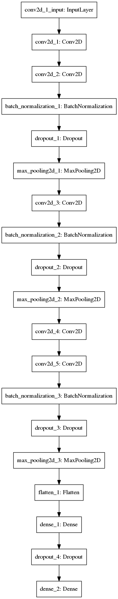

\# Character-Recognition-with-CNN
=================================

This is a small project to try detection of English characters from image.
Convolutional Neural Network is used for this purpose. The model is trained with
images of handwritten characters. The images are first processed to remove noise
and to be converted into binary. Then, they are stored into a csv file. Then
during training, the data is retrieved from the csv file. The model has achieved
94.63% training accuracy and 94.73% validation accuracy using 50 epochs, 64
batch size and 15948 training samples using Keras model. The model training is
inside the [a \*\*model_training.ipynb\*\*](model_training.ipynb) notebook. The
trained model is stored in the [a \*\*trained_model.h5\*\*](trained_model.h5)
file.

The data is stored in file:

[a train.csv](train.csv)

The architecture of the model is as follows:

